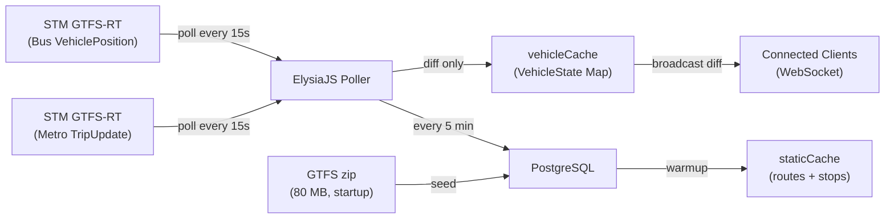
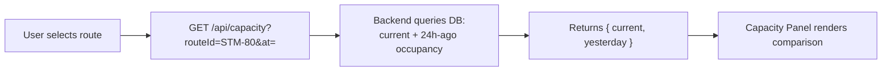
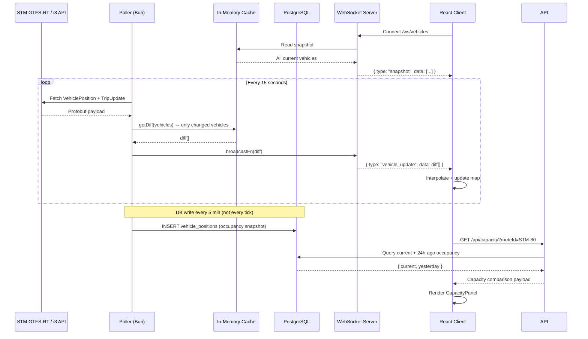

# 🚌🚇 MTL Tracker — Architecture & Design Document

A real-time web application that displays the live locations of STM buses and the Montreal metro, built with **Bun**, **React**, **ElysiaJS**, and **PostgreSQL**.

---

## 1. Data Sources

### 1.1 STM (Société de transport de Montréal)

STM is the primary transit operator on the Island of Montreal, running both the **metro** (4 lines, 68 stations) and an **island-wide bus network**.

| Resource             | URL                                                                      |
| -------------------- | ------------------------------------------------------------------------ |
| Developer portal     | [stm.info/en/about/developers](https://www.stm.info/en/about/developers) |
| Static GTFS download | `https://www.stm.info/sites/default/files/gtfs/gtfs_stm.zip`             |
| GTFS-RT + i3 API     | [portail.developpeurs.stm.info](https://portail.developpeurs.stm.info)   |

> [!NOTE]
> A developer account and API key have already been created and stored in `packages/server/.env`. The key covers both the GTFS-RT bus feed and the i3 metro API.

### 1.2 GTFS-Realtime Feed Types

The STM exposes two RT data sources:

- **GTFS-RT `VehiclePosition`** (buses) — lat/lon, bearing, speed, occupancy status, vehicle ID. Polled as a protobuf binary feed using `gtfs-realtime-bindings` on the server.
- **GTFS-RT `TripUpdate`** (buses + metro) — stop-time predictions and schedule deviation. For buses this gives delay info; for the metro (which has no GPS) this is the primary signal used to infer train positions.
- **`ServiceAlert`** — disruption and detour messages for both bus and metro.

> [!NOTE]
> The STM metro does not provide GPS-based `VehiclePosition` updates — trains run entirely underground. We use `TripUpdate` departure predictions from the GTFS-RT feed to infer which segment a train is on, then animate it along the known GTFS shape.

### 1.3 Data Source Strategy



### 1.4 Future Scope

The following agencies are **out of scope for v1** — their data portals need further investigation before committing to them:

- **exo** — commuter rail + suburban buses. GTFS-RT access requires a manual request form and data portals gave 404s during initial research.
- **RTL** — South Shore buses. Open data page needs verification.
- **REM** — Automated light metro. Data likely flows through ARTM; access path TBD.

---

## 2. System Architecture

The app lives in a Bun monorepo with two packages:

```
mtl-tracker/
├── packages/
│   ├── server/   # ElysiaJS backend
│   └── client/   # React frontend (Vite)
├── package.json  # workspace root
└── docker-compose.yml
```

```mermaid
graph TB
    subgraph "Frontend (Vite + React)"
        UI["Map View\n(react-map-gl / MapLibre)"]
        Store["Zustand Store"]
        WS["WebSocket Client"]
        Cap["Capacity Panel\n(24h comparison)"]
    end

    subgraph "Backend (Bun + ElysiaJS)"
        API["REST API\n/api/routes, /api/stops, /api/capacity"]
        WSS["WebSocket Server\n/ws/vehicles"]
        Poller["Poller Service\n(background task)"]
        Cache["vehicleCache\n(live positions + getDiff)"]\n        SCache["staticCache\n(routes + stops, 0 DB hits)"]
    end

    subgraph "Data Layer"
        PG[("PostgreSQL")]
    end

    subgraph "External"
        STMBUS["STM GTFS-RT\n(Bus VehiclePosition)"]
        STMI3["STM i3 API\n(Metro TripUpdates)"]
    end

    STMBUS -->|HTTP poll| Poller
    STMI3 -->|HTTP poll| Poller
    Poller --> Cache
    Poller -->|upsert| PG
    WSS -->|reads| Cache
    API -->|queries| PG
    WS <-->|real-time positions| WSS
    UI --> WS
    UI --> Store
    Cap -->|REST| API
```

---

## 3. Backend (`packages/server`)

### 3.1 Project Structure

```
server/
├── src/
│   ├── index.ts              # ElysiaJS app entry point
│   ├── types/
│   │   └── transit.ts        # Shared domain types (VehicleState, Route, Stop…)
│   ├── db/
│   │   ├── client.ts         # postgres.js connection pool
│   │   ├── schema.sql        # Table definitions (IF NOT EXISTS)
│   │   └── queries.ts        # Typed SQL queries
│   ├── gtfs/
│   │   └── loader.ts         # Downloads STM zip, seeds agencies/routes/stops/shapes
│   ├── cache/
│   │   ├── vehicleCache.ts   # Live position Map + getDiff() for WS broadcasts
│   │   └── staticCache.ts    # Routes + stops in-memory (warmed at startup)
│   ├── poller/
│   │   ├── index.ts          # setInterval (15s poll, 5min DB write, 1h prune)
│   │   ├── stm-bus.ts        # GTFS-RT VehiclePosition protobuf adapter
│   │   └── stm-metro.ts      # GTFS-RT TripUpdate adapter (metro position inference)
│   ├── ws/
│   │   └── vehicles.ws.ts    # WebSocket handler — snapshot on connect, diff on update
│   └── routes/
│       ├── vehicles.ts       # GET /api/vehicles (cache snapshot)
│       ├── routes.ts         # GET /api/routes   (from staticCache, 0 DB hits)
│       ├── stops.ts          # GET /api/stops    (from staticCache, 0 DB hits)
│       └── capacity.ts       # GET /api/capacity (24h comparison query)
└── package.json
```

### 3.2 Poller Service

The poller runs on a `setInterval` in the same Bun process. Each tick fetches both STM feeds in parallel, computes a **position diff** against the previous cache state, and only broadcasts vehicles that have moved. DB writes are batched to every 5 minutes to keep write volume low.

```typescript
// src/poller/index.ts
const POLL_INTERVAL_MS = 15_000; // fetch every 15 seconds
const DB_WRITE_INTERVAL = 5 * 60 * 1000; // write to DB every 5 minutes

export function startPoller() {
  setInterval(async () => {
    const [buses, metros] = await Promise.allSettled([
      fetchStmBusVehicles(), // GTFS-RT VehiclePosition protobuf → VehicleState[]
      fetchStmMetroUpdates(), // GTFS-RT TripUpdate → inferred metro positions
    ]);
    const all = [...buses, ...metros];
    const diff = vehicleCache.getDiff(all); // only vehicles that moved >~5m
    if (diff.length > 0) broadcastFn?.(diff);

    if (Date.now() - lastDbWrite >= DB_WRITE_INTERVAL) {
      lastDbWrite = Date.now();
      insertVehiclePositions(all); // non-blocking, for 24h capacity history
    }
  }, POLL_INTERVAL_MS);
}
```

### 3.3 REST + WebSocket Endpoints

| Method | Path                                 | Description                                               |
| ------ | ------------------------------------ | --------------------------------------------------------- |
| `GET`  | `/api/vehicles`                      | Current snapshot from `vehicleCache`                      |
| `GET`  | `/api/routes`                        | All routes — served from `staticCache` (0 DB hits)        |
| `GET`  | `/api/stops?routeId=...`             | Stops for a route — served from `staticCache` (0 DB hits) |
| `GET`  | `/api/capacity?routeId=...&at=<ISO>` | Occupancy at time T vs. same time 24h ago                 |
| `WS`   | `/ws/vehicles`                       | Snapshot on connect; diff-only updates every 15s          |

---

## 4. Database Schema (PostgreSQL)

PostgreSQL stores static GTFS reference data and a rolling 24-hour log of vehicle positions and occupancy.

Seeded at startup from the STM GTFS zip (**216 routes, 8,951 stops, 145,545 shape points** as of Feb 2026).

```sql
CREATE TABLE agencies (     -- 1 row: STM
  id    TEXT PRIMARY KEY,
  name  TEXT NOT NULL,
  color TEXT
);

CREATE TABLE routes (       -- 216 rows (bus + metro)
  id         TEXT PRIMARY KEY,  -- e.g. 'STM-1', 'STM-80'
  agency_id  TEXT NOT NULL REFERENCES agencies(id),
  short_name TEXT NOT NULL,
  long_name  TEXT NOT NULL,
  type       TEXT NOT NULL      -- 'metro' | 'bus'
);

CREATE TABLE stops (        -- 8,951 rows; route_id is nullable (stops serve multiple routes)
  id        TEXT PRIMARY KEY,
  route_id  TEXT REFERENCES routes(id),
  name      TEXT NOT NULL,
  lat       DOUBLE PRECISION NOT NULL,
  lon       DOUBLE PRECISION NOT NULL,
  sequence  INT NOT NULL DEFAULT 0
);

CREATE TABLE shapes (       -- 145,545 rows; track geometry for map polylines + metro animation
  shape_id  TEXT NOT NULL,
  lat       DOUBLE PRECISION NOT NULL,
  lon       DOUBLE PRECISION NOT NULL,
  sequence  INT NOT NULL,
  PRIMARY KEY (shape_id, sequence)
);

-- Append-only write log: written every 5 min, retained for 48h, then pruned
CREATE TABLE vehicle_positions (
  id          BIGSERIAL PRIMARY KEY,
  vehicle_id  TEXT NOT NULL,
  route_id    TEXT REFERENCES routes(id),
  trip_id     TEXT,
  lat         DOUBLE PRECISION,
  lon         DOUBLE PRECISION,
  bearing     SMALLINT,
  speed       REAL,         -- km/h
  delay_sec   INT,          -- seconds behind schedule (negative = early)
  occupancy   TEXT,         -- GTFS-RT OccupancyStatus enum value
  recorded_at TIMESTAMPTZ NOT NULL DEFAULT now()
);

CREATE INDEX ON vehicle_positions (route_id, recorded_at DESC);
CREATE INDEX ON vehicle_positions USING BRIN (recorded_at);
```

> [!TIP]
> Enable **PostGIS** (`CREATE EXTENSION postgis;`) and store `lat/lon` as `GEOGRAPHY(POINT)` for efficient spatial queries, e.g. "show all vehicles within the current map viewport bounding box."

---

## 5. Capacity Comparison Feature

This is the defining feature of MTL Tracker. For any route, riders can see **current occupancy vs. the same route at the same time yesterday**.

### 5.1 How Occupancy Data is Captured

GTFS-RT `VehiclePosition` feeds include an optional `occupancy_status` field with values like:
`EMPTY`, `MANY_SEATS_AVAILABLE`, `FEW_SEATS_AVAILABLE`, `STANDING_ROOM_ONLY`, `CRUSHED_STANDING_ROOM_ONLY`, `FULL`.

These are stored as-is in the `occupancy` column on every `vehicle_positions` write.

### 5.2 The Comparison Query

```sql
-- Current occupancy for a route
SELECT vehicle_id, occupancy, recorded_at
FROM vehicle_positions
WHERE route_id = $1
  AND recorded_at >= now() - interval '2 minutes'
ORDER BY recorded_at DESC;

-- Same route, 24 hours ago (±5 minute window)
SELECT vehicle_id, occupancy, recorded_at
FROM vehicle_positions
WHERE route_id = $1
  AND recorded_at BETWEEN (now() - interval '24 hours 5 minutes')
                      AND (now() - interval '23 hours 55 minutes')
ORDER BY recorded_at DESC;
```

### 5.3 Capacity Panel (Frontend)

The UI exposes a **Capacity Panel** that appears when a user selects a route. It shows:

- A color-coded occupancy badge for the **current moment**
- A color-coded occupancy badge for the **same time yesterday**
- A simple "busier / quieter / similar to yesterday" summary label



---

## 6. Frontend (`packages/client`)

### 6.1 Key Libraries

| Library        | Purpose                                                         |
| -------------- | --------------------------------------------------------------- |
| `maplibre-gl`  | WebGL map engine — handles thousands of moving markers at 60fps |
| `react-map-gl` | React wrapper for MapLibre                                      |
| `zustand`      | Global state (vehicles, filters, selected route/vehicle)        |
| `date-fns`     | Timestamp formatting                                            |

**Server-side only:** `gtfs-realtime-bindings` decodes the protobuf binary payloads from the STM GTFS-RT feed — this runs in the ElysiaJS backend, not the browser.

**Map tiles:** Use [Protomaps](https://protomaps.com/) (self-hosted `.pmtiles` file for Montreal) or the free [MapTiler](https://www.maptiler.com/) community plan. Both avoid per-request billing.

### 6.2 Project Structure

```
client/
├── src/
│   ├── main.tsx
│   ├── App.tsx
│   ├── components/
│   │   ├── MapView.tsx          # MapLibre canvas + all layers
│   │   ├── VehicleLayer.tsx     # GeoJSON source + circle/symbol layers
│   │   ├── RouteLayer.tsx       # Static polylines
│   │   ├── StopsLayer.tsx       # Stop dots (visible at zoom 13+)
│   │   ├── Sidebar.tsx          # Left panel shell
│   │   ├── FilterPanel.tsx      # Bus/metro toggle filter
│   │   ├── CapacityPanel.tsx    # 24h occupancy comparison card
│   │   ├── VehicleDetail.tsx    # Popup on vehicle click
│   │   └── StatusBar.tsx        # Live indicator + last update time
│   ├── hooks/
│   │   ├── useVehicleSocket.ts  # WebSocket + exponential backoff reconnect
│   │   └── useInterpolation.ts  # Smooth position animation between polls
│   ├── store/
│   │   ├── vehicleStore.ts      # Live + interpolated vehicle positions
│   │   └── uiStore.ts           # Filters, selected vehicle, viewport
│   └── lib/
│       ├── toGeoJSON.ts         # VehicleState[] → GeoJSON FeatureCollection
│       └── colors.ts            # Agency brand color map
└── package.json
```

### 6.3 STM Route Colors

```typescript
// src/lib/colors.ts
export const ROUTE_COLORS: Record<string, string> = {
  // Metro lines (official STM brand colors)
  "STM-1": "#4db748", // Green line
  "STM-2": "#f08123", // Orange line
  "STM-4": "#ffcc00", // Yellow line
  "STM-5": "#0b4ea2", // Blue line
  // Bus (single generic STM color)
  "STM-bus": "#009da5",
};
```

### 6.4 Smooth Vehicle Animation

Polls fire every 15 seconds. To avoid vehicles teleporting, we interpolate positions using `requestAnimationFrame` between each poll cycle — vehicles glide smoothly to their new positions over the 15-second window.

### 6.5 Metro Position Inference

The STM metro has no GPS — trains run entirely underground. We infer position from the **GTFS-RT `TripUpdate` feed** (same endpoint as buses, different route IDs):

1. Filter `TripUpdate` entities to metro route IDs (`1`, `2`, `4`, `5`)
2. Find the first upcoming stop (departure time in the future)
3. Calculate how far along the segment between the previous and next stop the train is (`interpolationFraction` 0→1)
4. Pass `nextStopSequence` + `interpolationFraction` to the frontend alongside the `VehicleState`
5. Frontend looks up the GTFS shape for the trip and animates the train dot along the fixed track geometry

---

## 7. Data Flow: End-to-End



---

## 8. Phased Roadmap

### Phase 1 — Foundation

- [x] Bun monorepo + `package.json` workspaces
- [x] `.env`, `.gitignore`, STM API key confirmed working against live endpoint
- [x] `docker-compose.yml` — PostgreSQL 16 running in Docker
- [x] PostgreSQL schema + `IF NOT EXISTS` migrations (run on every startup)
- [x] GTFS static loader — downloads STM zip, seeds 216 routes / 8,951 stops / 145,545 shape points
- [x] `staticCache` — routes + stops warmed into memory at startup (0 DB hits on `/api/routes`, `/api/stops`)
- [x] REST endpoints: `/api/vehicles`, `/api/routes`, `/api/stops`, `/api/capacity`

### Phase 2 — Real-time Core

- [x] GTFS-RT `VehiclePosition` poller for STM buses (protobuf via `gtfs-realtime-bindings`)
- [x] GTFS-RT `TripUpdate` poller for STM metro (position inference with `interpolationFraction`)
- [x] `vehicleCache` with `getDiff()` — broadcasts only moved vehicles (~80–90% payload reduction)
- [x] WebSocket server — snapshot on connect, diff-only updates every 15s
- [x] DB write downsampled to every 5 minutes (20× less write volume)
- [ ] Moving vehicle dots on the map with STM route colors ← **frontend**
- [ ] Smooth position interpolation between polls ← **frontend**

### Phase 3 — Metro & Capacity

- [x] Metro position inference logic in `stm-metro.ts` (backend complete)
- [x] `occupancy` captured in `vehicle_positions` DB writes
- [x] `/api/capacity` endpoint with 24h lookback query
- [ ] Metro animation along GTFS shape in frontend ← **frontend**
- [ ] `CapacityPanel` component ← **frontend**

### Phase 4 — Polish

- [ ] Service alert banners from `ServiceAlert` feeds
- [ ] Filter panel (toggle bus/metro)
- [ ] Vehicle detail popup (route, delay, occupancy)
- [ ] DB `vehicle_positions` auto-prune (48h retention, hourly job ✅ already implemented)
